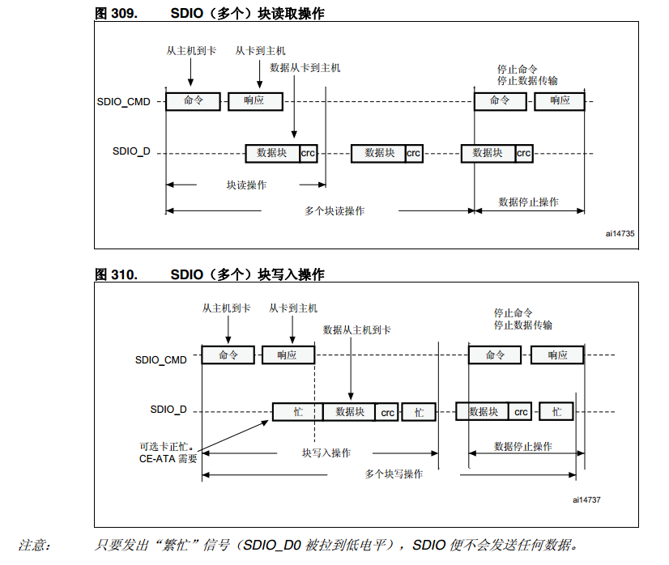
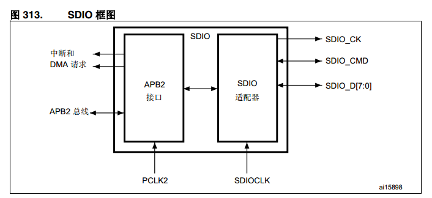
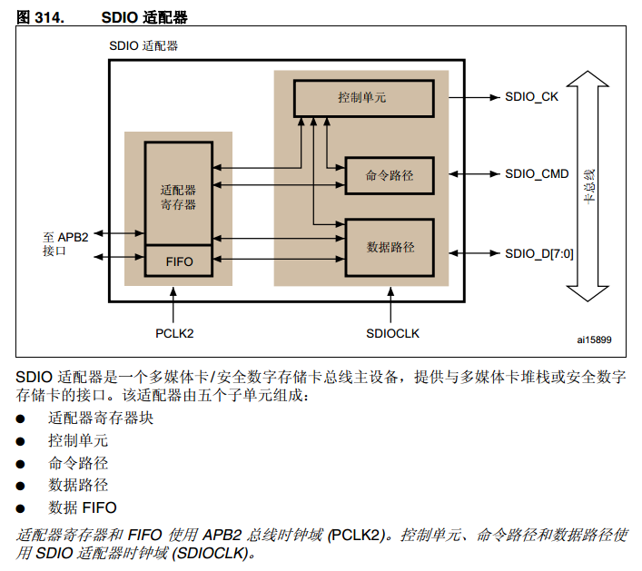
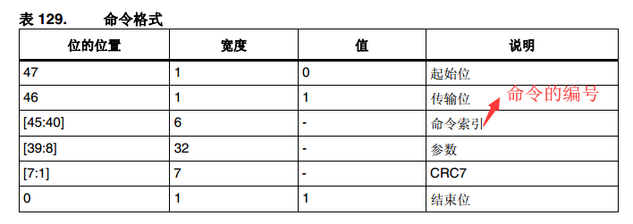
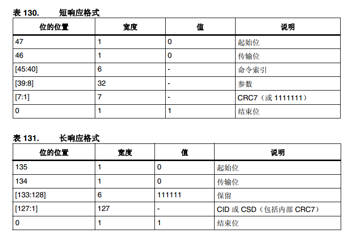

# SDIO接口介绍
```sh
描述:
  SDIO:安全数字输入/输出接口
功能描述：
  软体层面：一种数据通信（传输）协议
  硬件层面：是一种物理连接接口
```
# 1. SDIO模块时钟介绍
```sh
SDIO时钟分为三部分：
  卡时钟：SDIO接口给卡提供的时钟（卡的驱动时钟：SDIO_CK）
  SDIO适配器时钟：(SDIO适配器的驱动时钟)
  总线接口时钟：（总线的驱动时钟：设置SDIO接口的寄存器）
```

# 2. SDIO 总线拓扑
```SH
SDIO通信分为：
  1. 命令传输：通过SDCMD引脚进行传输（卡是否需要对主机命令做出相应取决于主机的设置）
  2. 数据传输：通过SDDATAx引脚进行传输
```
* 读写时序图



# 3. SDIO接口组成
```sh
SDIO 由两部分组成:
  SDIO 适配器块提供特定于 MMC/SD/SD I/O 卡的所有功能，如时钟生成单元、命令和数据传输。
  APB2 接口访问 SDIO 适配器寄存器，并且生成中断和 DMA 请求信号。
```


* 适配器模块介绍



# 4. SDIO命令和响应格式
* 命令格式



```sh
注意：
SDIO 支持两种响应类型：
  ● 48 位短响应
  ● 136 位长响应

命令寄存器包含命令索引、命令类型。它们确定命令是否需要响应以及响应的长度是 48 位还是 136 位。
```


# 5. 卡识别过程
```sh
在卡识别模式下，主机复位所有卡，验证运行电压范围，识别卡并在总线上为每个卡设置相对卡地址 (RCA)。卡识别模式中的所有数据通信都仅使用命令行 (CMD)。
```
