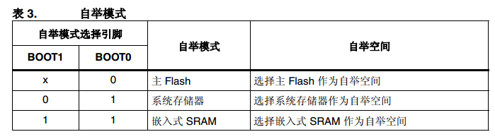
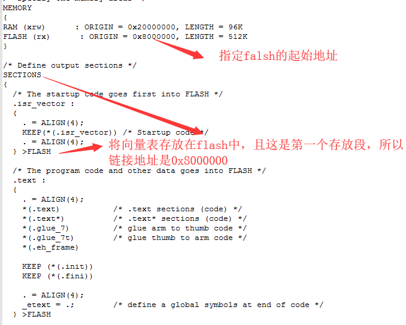
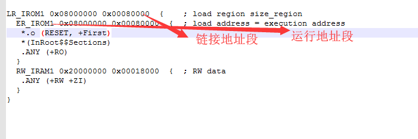

# tm32启动模式与地址映射
```sh
概述：
  本章简略分析一下stm32的启动方式、物理地址映射、软体的链接地址
参考资料：
  stm32f4xx中文参考手册第2章（2.4 自举配置）
  stm32f4xx中文参考手册第8章（8.2.1）
```

## 1. 启动引脚配置
```sh
存储器采用固定的存储器映射，代码区域起始地址为 0x0000 0000（通过 ICode/DCode 总
线访问），而数据区域起始地址为 0x2000 0000（通过系统总线访问）。 Cortex™-M4F
CPU 始终通过 ICode 总线获取复位向量，这意味着只有代码区域（通常为 Flash）可以提供
启动空间。
```



## 2. 物理地址重映射
```sh
这里以falsh作为启动配置为例：

通过上文的描述可以知道，复位后，CPU通过 ICode总线从0地址处取指，所以stm32f4xx会
动根据启动引脚的配置将实际的存放代码的物理内存地址（0x0800 0000 - 0x080F FFFF）映
射到（0x0000 0000 - 0x03FFFFFF）这一区域。
```
```sh
在系统复位后，当CPU操作（0x0000 0000 - 0x03FFFFFF）这一区域时，实际操作的地址空间如下所示：
 const uint32_t FLASH_START = 0x08000000;
 const uint32_t SRAM_START = 0x20000000;
 const uint32_t SYSTEM_MEMORY_START = 0x1FFF0000;

inline amba_pv_resp_t read(int socket_id, const uint64& addr, uint8_t* data, uint32_t size, const amba_pv_control* ctrl, sc_time& t)
       {
           switch (m_boot_mode)
           {
               case FLASH_MEMORY:
               {
                   return pvbus_m.read(stm32f401re::FLASH_START + addr, data, size, ctrl, t);
               }break;
               case SRAM_MEMORY:
               {
                   return pvbus_m.read(stm32f401re::SRAM_START + addr, data, size, ctrl, t);
               }break;
               case SYSTEM_MEMORY:
               {
                   return pvbus_m.read(stm32f401re::SYSTEM_MEMORY_START + addr, data, size, ctrl, t);
               }break;
           }
           return AMBA_PV_DECERR;
       }
```

# 3. 链接地址
```sh
无论系统的启动方式如何，裸机程序的链接地址都是代码存放的实际物理地址。

本文以falsh启动为例：
应为falsh的实际物理地址是0x08000000，所以代码的链接地址也是0x08000000。
```
## 3.1 makefile方式的链接地址

cat STM32F401RETx_FLASH.ld


## 3.2 mdk方式的链接地址

cat gpio_out.sct （这个是mdk的链接脚本）

